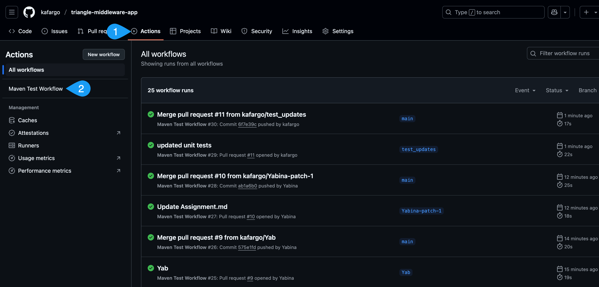
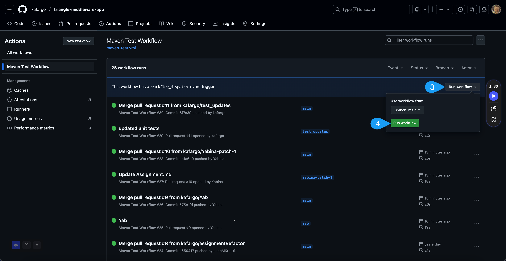
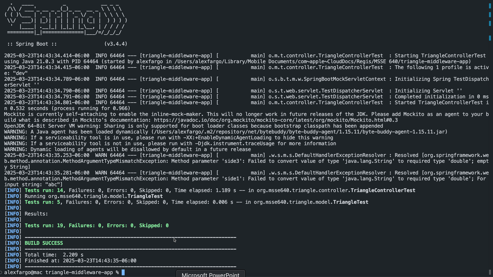

# Assignment 1: Unit Testing

---

#### <ins> Table of Contents </ins>

- [Introduction](#introduction)
  - [Overview of the Program](#overview-of-the-program)
  - [How Errors Were Handled](#how-errors-were-handled)
  - [Choice of Unit Tests](#choice-of-unit-tests)
  - [Summary](#summary)
- [Program Details](#program-details)
   - [IDE Choice](#ide-choice)
   - [Technical Overview of the Triangle Middleware Application](#technical-overview-of-the-triangle-middleware-application)
   - [How to Interface with the API](#how-to-interface-with-the-api)
- [Unit Tests](#unit-tests)
   - [Test Cases](#test-cases)
   - [Example Test Data](#example-test-data)
   - [Bugs Encountered](#bugs-encountered)
   - [Problems](#problems)
- [Screen Shots](#screen-shots)
- [Recommendations](#recommendations)
- [References](#references)
   - [_The Art of Software Testing_](#the-art-of-software-testing)
   - [GitHub](#github)

---

---

# Introduction

## Overview of the Program

&nbsp;&nbsp;&nbsp;&nbsp;&nbsp;&nbsp; The **Triangle Middleware Application** is a Spring Boot-based RESTful API designed to determine the type of a triangle based on the lengths of its sides. The application provides a single endpoint, `/triangle/type`, which accepts three parameters (`side1`, `side2`, and `side3`) representing the lengths of the triangle's sides. Based on the input, the API returns one of the following results:

- **Equilateral**: All three sides are equal.
- **Isosceles**: Two sides are equal.
- **Scalene**: All three sides are different.
- **Invalid triangle sides**: The input does not form a valid triangle (e.g., sides are zero or negative).

The application also integrates Swagger for API documentation, making it easy to test and explore the API via a web interface at `/swagger-ui.html`.

## How Errors Were Handled

Error handling was implemented at multiple levels to ensure robustness and user-friendly responses:

1. **Input Validation**:

   - The `Triangle` model class checks if any side is less than or equal to zero. If so, it returns `"Invalid triangle sides"`.
   - The `TriangleController` uses Spring's `@RequestParam` to automatically validate and parse the input parameters. If invalid data (e.g., non-numeric strings) is provided, Spring automatically returns a `400 Bad Request` response.

2. **Exception Handling**:

   - The `Triangle` class gracefully handles invalid input by returning a meaningful message (`"Invalid triangle sides"`) instead of throwing exceptions.
   - For invalid string inputs (e.g., `"abc"`), the unit tests ensure that a `NumberFormatException` is thrown and handled appropriately.

3. **API-Level Error Responses**:

   - The API returns appropriate HTTP status codes:
     - `200 OK` for valid triangle types.
     - `400 Bad Request` for invalid input (e.g., non-numeric values).

## Choice of Unit Tests

&nbsp;&nbsp;&nbsp;&nbsp;&nbsp;&nbsp; Unit tests (using JUnit) were designed to cover all possible scenarios for determining the type of a triangle. The tests ensure the correctness of the application and validate its behavior under edge cases. Below is an overview of the unit tests:

### 1. Controller Tests

- **Purpose**: To test the `/triangle/type` endpoint and ensure it returns the correct triangle type or error response.
- **Test Cases**:
  - **Equilateral Triangle**: Input sides `3, 3, 3` should return `"Equilateral"`.
  - **Isosceles Triangle**: Input sides `3, 3, 4` should return `"Isosceles"`.
  - **Scalene Triangle**: Input sides `3, 4, 5` should return `"Scalene"`.
  - **Invalid Triangle**: Input sides `0, 4, 5` should return `"Invalid triangle sides"`.
  - **Invalid String Input**: Input sides `abc, 4, 5` should return a `400 Bad Request`.

### 2. Model Tests

- **Purpose**: To test the logic in the `Triangle` class for determining the triangle type.
- **Test Cases**:
  - **Equilateral Triangle**: Verify that `Triangle(3, 3, 3).getType()` returns `"Equilateral"`.
  - **Isosceles Triangle**: Verify that `Triangle(3, 3, 4).getType()` returns `"Isosceles"`.
  - **Scalene Triangle**: Verify that `Triangle(3, 4, 5).getType()` returns `"Scalene"`.
  - **Invalid Triangle**: Verify that `Triangle(0, 4, 5).getType()` returns `"Invalid triangle sides"`.
  - **Invalid String Input**: Ensure that passing a non-numeric value (e.g., `"zyx"`) throws a `NumberFormatException`.

### 3. Integration Tests

- While not explicitly implemented, the combination of controller and model tests ensures end-to-end validation of the application's functionality.

## Summary

&nbsp;&nbsp;&nbsp;&nbsp;&nbsp;&nbsp; The **Triangle Middleware Application** is a robust and well-tested API that handles errors gracefully and provides clear feedback to users. The choice of unit tests ensures comprehensive coverage of all possible scenarios, including valid inputs, invalid inputs, and edge cases. This approach guarantees the reliability and correctness of the application in real-world usage.


##### [Back to TOC](#table-of-contents)

---

# Program Details

## IDE Choice

&nbsp;&nbsp;&nbsp;&nbsp;&nbsp;&nbsp; We chose to use **Visual Studio Code** (VS Code) for our program implementation. VS Code proved to be an excellent IDE for running and managing the **Triangle Middleware Application** due to its lightweight nature, extensive plugin ecosystem, and robust debugging capabilities. Here are some key benefits:

1. **Integrated Development Environment**:

   - VS Code provides a seamless environment for writing, testing, and debugging Java applications. With extensions like the "Java Extension Pack," you can easily manage Maven dependencies, run unit tests, and debug your Spring Boot application.

2. **Built-in Terminal**:

   - The integrated terminal allows you to execute Maven commands (e.g., `mvn clean install`, `mvn spring-boot:run`) without leaving the IDE, streamlining the development workflow.

3. **Spring Boot Support**:

   - Extensions like "Spring Boot Tools" provide features such as live application monitoring, Spring Boot-specific code assistance, and easy navigation through Spring components.

4. **Swagger Integration**:

   - VS Code's REST Client extension allows you to test the API directly from the IDE by sending HTTP requests to the application's endpoints.

5. **Git Integration**:

   - The built-in Git support makes it easy to manage version control, push changes to GitHub, and collaborate with team members.

6. **Debugging**:
   - VS Code's debugging tools allow you to set breakpoints, inspect variables, and step through the code, making it easier to identify and resolve issues.


## Technical Overview of the Triangle Middleware Application

&nbsp;&nbsp;&nbsp;&nbsp;&nbsp;&nbsp; The **Triangle Middleware Application** is a Spring Boot-based RESTful API designed to determine the type of a triangle based on the lengths of its sides. Below is a technical breakdown of the application:

1. **Core Functionality**:

   - The application provides a single endpoint, `/triangle/type`, which accepts three parameters (`side1`, `side2`, `side3`) representing the lengths of the triangle's sides.
   - Based on the input, the API determines the type of triangle:
     - **Equilateral**: All three sides are equal.
     - **Isosceles**: Two sides are equal.
     - **Scalene**: All three sides are different.
     - **Invalid triangle sides**: The input does not form a valid triangle (e.g., sides are zero or negative).

2. **Error Handling**:

   - Input validation ensures that sides are positive numbers.
   - Invalid inputs (e.g., non-numeric values) result in a `400 Bad Request` response.
   - The application gracefully handles invalid triangle sides by returning a meaningful message.

3. **Swagger Integration**:

   - Swagger is integrated for API documentation and testing. The Swagger UI is accessible at `/swagger-ui.html`.

4. **Unit Testing**:

   - Comprehensive unit tests (using JUnit) validate the application's functionality, covering all edge cases.

5. **Configuration**:
   - The application is configured to run on port `8080` (defined in `application.properties`).


## How to Interface with the API

### Hosted Endpoint

&nbsp;&nbsp;&nbsp;&nbsp;&nbsp;&nbsp; If the application is hosted on a server, you can interact with the API by sending HTTP POST requests to the `/triangle/type` endpoint. Below is an example using `curl`:

```bash
curl -X POST "http://<host>:8080/triangle/type" \
     -d "side1=3" -d "side2=3" -d "side3=3"
```

### Using Swagger to Interface with the API

Swagger provides an interactive web interface to explore and test the API. To access Swagger:

1. **Start the Application**:

   - Run the application using the following Maven command:
     ```bash
     mvn spring-boot:run
     ```

2. **Access the Swagger UI**:

   - Open a web browser and navigate to:
     ```
     http://localhost:8080/swagger-ui.html
     ```

3. **Explore the API**:

   - The Swagger UI will display the available endpoints, including `/triangle/type`.
   - You can test the endpoint by providing input values for `side1`, `side2`, and `side3` directly in the Swagger interface.

4. **Example Usage in Swagger**:

   - Input: `side1=3`, `side2=3`, `side3=3`
     - Expected Response: `"Equilateral"`
   - Input: `side1=3`, `side2=3`, `side3=4`
     - Expected Response: `"Isosceles"`
   - Input: `side1=3`, `side2=4`, `side3=5`
     - Expected Response: `"Scalene"`
   - Input: `side1=0`, `side2=4`, `side3=5`
     - Expected Response: `"Invalid triangle sides"`

5. **Benefits of Swagger**:
   - Provides a user-friendly interface for testing the API without needing external tools like `curl` or Postman.
   - Automatically documents the API, making it easier for developers to understand and use the endpoints.
   - Displays detailed request and response formats, including error messages for invalid inputs.

By using Swagger, you can efficiently test and interact with the **Triangle Middleware Application** without writing additional client code.

##### [Back to TOC](#table-of-contents)

---

# Unit Tests

&nbsp;&nbsp;&nbsp;&nbsp;&nbsp;&nbsp; The unit tests in `TriangleControllerTest.java` validate the `TriangleController` class, which determines the type of triangle based on side lengths. The tests cover various scenarios to ensure correct handling of inputs and expected outcomes.

## **Test Cases**

1. **Equilateral Triangle**:

   - Input: `3, 3, 3`
   - Expected: `"Equilateral"`
   - Purpose: Verify identification of triangles with all sides equal.

2. **Equilateral Triangle with Decimals**:

   - Input: `6.2, 6.2, 6.2`
   - Expected: `"Equilateral"`
   - Purpose: Ensure handling of decimal values.

3. **Isosceles Triangle**:

   - Input: `3, 3, 4`
   - Expected: `"Isosceles"`
   - Purpose: Verify identification of triangles with two equal sides.

4. **Scalene Triangle**:

   - Input: `3, 4, 5`
   - Expected: `"Scalene"`
   - Purpose: Verify identification of triangles with all sides different.

5. **Invalid Triangle (Zero Side)**:

   - Input: `0, 4, 5`
   - Expected: `"Invalid triangle sides"`
   - Purpose: Detect invalid triangles with a zero side.

6. **Invalid Triangle (All Sides Zero)**:

   - Input: `0, 0, 0`
   - Expected: `"Invalid triangle sides"`
   - Purpose: Handle cases where all sides are zero.

7. **Invalid Input (Empty Side)**:

   - Input: `5, 6, " "`
   - Expected: HTTP 400 Bad Request
   - Purpose: Handle empty or non-numeric inputs.

8. **Scalene Triangle with Decimals**:

   - Input: `3.5, 4.5, 5.5`
   - Expected: `"Scalene"`
   - Purpose: Validate decimal side lengths.

9. **Invalid Triangle (Negative Side)**:

   - Input: `-5, 2, 2`
   - Expected: `"Triangle sides cannot be negative value"`
   - Purpose: Reject negative side lengths.

10. **Invalid Input (String Input)**:

    - Input: `"abc", 4, 5`
    - Expected: HTTP 400 Bad Request
    - Purpose: Handle non-numeric inputs.

11. **Invalid Isosceles Triangle (Sum of Two Sides Equal to Third)**:

    - Input: `2, 2, 4`
    - Expected: `"The sum of two sides shouldn't be equal to the other side"`
    - Purpose: Enforce triangle inequality theorem.

12. **Invalid Isosceles Triangle (Sum of Two Sides Less Than Third)**:

    - Input: `2, 2, 5`
    - Expected: `"The sum of two sides shouldn't be less than the other side"`
    - Purpose: Further validate triangle inequality.

13. **Invalid Scalene Triangle (Sum of Two Sides Equal to Third)**:

    - Input: `1, 2, 3`
    - Expected: `"The sum of two sides shouldn't be equal to the other side"`
    - Purpose: Handle edge cases for scalene triangles.

14. **Invalid Scalene Triangle (Sum of Two Sides Less Than Third)**:
    - Input: `2, 5, 13`
    - Expected: `"The sum of two sides shouldn't be less than the other side"`
    - Purpose: Further validate triangle inequality for scalene triangles.

### **Why These Tests Were Chosen**

1. **Coverage**: Tests cover all valid triangle types (equilateral, isosceles, scalene).
2. **Edge Cases**: Include zero, negative, and invalid inputs to ensure robustness.
3. **Triangle Inequality**: Validate that the sum of any two sides is greater than the third.
4. **Decimal Values**: Ensure correct handling of non-integer side lengths.
5. **Error Handling**: Verify appropriate error messages and HTTP status codes.
6. **Robustness**: Ensure the system handles a wide range of inputs, including edge cases and invalid data.

These tests ensure the `TriangleController` is reliable, accurate, and robust in determining triangle types and handling invalid inputs.

## Example Test Data

| Testcase ID | Test Case Description                         | Input Values (side1, side2, side3) | Expected Outcome                          |
| ----------- | --------------------------------------------- | ---------------------------------- | ----------------------------------------- |
| TC1         | Test Equilateral Triangle                     | 3, 3, 3                            | "Equilateral"                             |
| TC2         | Test Equilateral Triangle with Decimal Values | 6.2, 6.2, 6.2                      | "Equilateral"                             |
| TC3         | Test Isosceles Triangle                       | 3, 3, 4                            | "Isosceles"                               |
| TC4         | Test Scalene Triangle                         | 3, 4, 5                            | "Scalene"                                 |
| TC5         | Test Triangle with a single Zero value Side   | 0, 4, 5                            | "Invalid triangle sides"                  |
| TC6         | Test Invalid Triangle (All Sides Zero)        | 0, 0, 0                            | "Invalid triangle sides"                  |
| TC7         | Test Invalid Input (Empty Side)               | 5, 6, " "                          | HTTP 400 Bad Request                      |
| TC          | Test Scalene Triangle with Decimal Values     | 3.5, 4.5, 5.5                      | "Scalene"                                 |
| TC9         | Test Invalid Triangle (Negative Side)         | -5, 2, 2                           | "Triangle sides cannot be negative value" |
| TC10        | Test Invalid Input (String Input)             | "abc", 4, 5                        | HTTP 400 Bad Request                      |

## Bugs Encountered

&nbsp;&nbsp;&nbsp;&nbsp;&nbsp;&nbsp; Our program seemed to pass until we started to test our program along our test cases. One bug we ecountered early was to see if the sides satisfied the triangle inequality theorem. After a quick google search, we were able to incorporate a boundary statement within a boolean function to satisfy the theorm against user input. 

&nbsp;&nbsp;&nbsp;&nbsp;&nbsp;&nbsp; Another bug we found was that our initial user input didn't accept decimals since it was only accounting for ints. We changed the program logic to account for inputs as type floats, but soon relalized after black-box testing that it was still crashing. So finally, we changed our Input value types from float to double which seems to have satified the numeric imput user type requirement.

## Problems

&nbsp;&nbsp;&nbsp;&nbsp;&nbsp;&nbsp; One of the main problems we faced was trying to come up with as many test cases as possible to ensure we have a working quality program. Referencing Chapter 1 in [The Art of Software Testing](#references) helped gain insight to the types of test cases we needed to implement. Even though our test cases are not as comprehensive as the Chapter's example, we believe we have good test coverage across the program.

&nbsp;&nbsp;&nbsp;&nbsp;&nbsp;&nbsp; Another problem faced was coming up with a robust logic in our code to fulfill all the specifications that makes the Traingles Scalene, Equilateral or Isosceles. We found to be using boundary statements as our primary conditonal logic. If we were to continue this program, a thought would be to reprogram the functions to eliminate as many boundary statements as we could to make the program less vunerable. 

##### [Back to TOC](#table-of-contents)

---

# Screen Shots

Running the Action:





Testing locally:



##### [Back to TOC](#table-of-contents)

---

# Recommendations

I would recomend keeping the entire assingment in GitHub like this and not in a seperate word document.


##### [Back to TOC](#table-of-contents)

---

# References

#### _The Art of Software Testing_

Myers, G. J., Sandler, C., & Badgett, T. (2011). _The Art of Software Testing_. John Wiley & Sons. [📖](https://malenezi.github.io/malenezi/SE401/Books/114-the-art-of-software-testing-3-edition.pdf)

#### GitHub

Desta, Y., Fargo, K. A., & John, K. M. (n.d.). _MSSE 640 Assignment 1_. GitHub. https://github.com/kafargo/triangle-middleware-app
