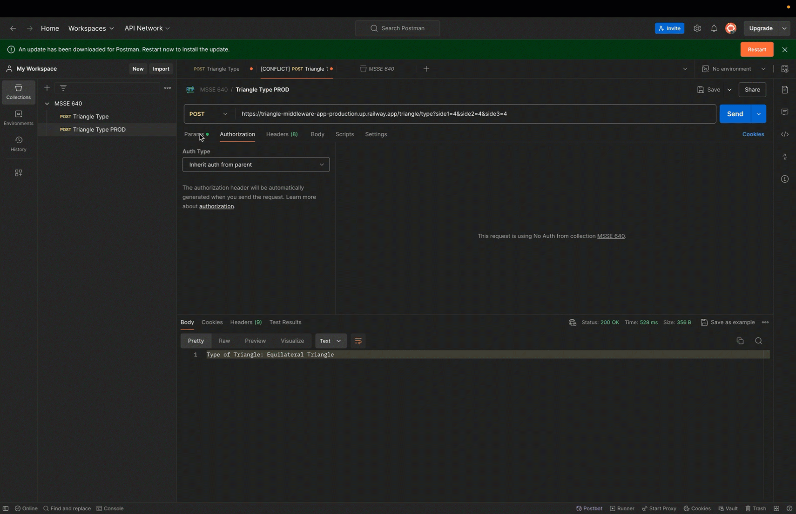

# HTTP and APIs Overview

## Basic Functionality of HTTP

### Clients

Clients are the entities that initiate requests. They are typically web browsers or any other application that can send HTTP requests to servers[1](https://www.moesif.com/blog/technical/api-development/What-Is-Open-API/).

### Servers

Servers are the entities that receive requests from clients. They process these requests and send back responses[1](https://www.moesif.com/blog/technical/api-development/What-Is-Open-API/).

### Requests

An HTTP request is a message sent by the client to the server, asking for a resource or action. It includes a request line (method, URL, HTTP version), headers, and an optional body[1](https://www.moesif.com/blog/technical/api-development/What-Is-Open-API/).

### Responses

An HTTP response is the message sent by the server back to the client. It includes a status line (HTTP version, status code, reason phrase), headers, and an optional body[1](https://www.moesif.com/blog/technical/api-development/What-Is-Open-API/).

### Headers vs. Body

- **Headers**: Contain metadata about the request or response, such as content type, length, and encoding[1](https://www.moesif.com/blog/technical/api-development/What-Is-Open-API/).
- **Body**: Contains the actual data being transmitted, such as HTML content, JSON data, etc[1](https://www.moesif.com/blog/technical/api-development/What-Is-Open-API/).

### Status Codes

Status codes are part of the response and indicate the result of the request. Common status codes include:

- **200 OK**: The request was successful.
- **404 Not Found**: The requested resource was not found.
- **500 Internal Server Error**: The server encountered an error[1](https://www.moesif.com/blog/technical/api-development/What-Is-Open-API/).

### HTTP Verbs

- **GET**: Retrieve data from the server.
- **POST**: Send data to the server to create a new resource.
- **PUT**: Update an existing resource on the server.
- **DELETE**: Remove a resource from the server[1](https://www.moesif.com/blog/technical/api-development/What-Is-Open-API/).

## Statelessness of HTTP

HTTP is considered stateless because each request from a client to a server is independent. The server does not retain any information about previous requests. This means that each request must contain all the information necessary for the server to understand and process it[1](https://www.moesif.com/blog/technical/api-development/What-Is-Open-API/).

## Role of APIs in Modern Applications

APIs (Application Programming Interfaces) are crucial in modern software development. They allow different software systems to communicate and share data, enabling the integration of various services and functionalities[2](https://swagger.io/blog/api-strategy/benefits-of-openapi-api-development/).

### Open APIs

Open APIs, also known as public APIs, are accessible to external developers and other users. They allow third-party developers to build applications that interact with the services provided by the API. Open APIs are important because they foster innovation and enable the creation of new applications and services[2](https://swagger.io/blog/api-strategy/benefits-of-openapi-api-development/).

### Example of Open API Usage

One modern application of Open APIs is in the e-commerce sector. For instance, an online retail store can use APIs to connect with payment processors like PayPal or Stripe. When a customer makes a purchase, the API facilitates the transaction, ensuring that payment is processed securely and efficiently[2](https://swagger.io/blog/api-strategy/benefits-of-openapi-api-development/).

## Cross-Origin Resource Sharing (CORS)

CORS is an HTTP-header based mechanism that allows a server to indicate any origins (domain, scheme, or port) other than its own from which a browser should permit loading resources. It is used to enable secure cross-origin requests and data transfers between browsers and servers[3](https://hbr.org/2021/04/apis-arent-just-for-tech-companies).

## References

1. [What Is Open API?](https://www.moesif.com/blog/technical/api-development/What-Is-Open-API/) - Moesif Blog
2. [Benefits of OpenAPI in API Development](https://swagger.io/blog/api-strategy/benefits-of-openapi-api-development/) - Swagger Blog
3. [APIs Aren’t Just for Tech Companies](https://hbr.org/2021/04/apis-arent-just-for-tech-companies) - Harvard Business Review
4. [Cross-Origin Resource Sharing (CORS)](https://developer.mozilla.org/en-US/docs/Web/HTTP/Guides/CORS) - MDN Web Docs

