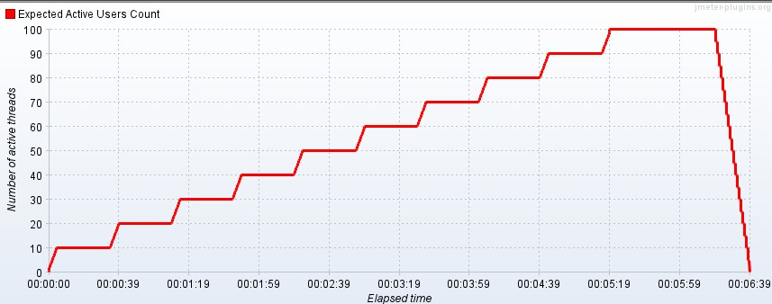
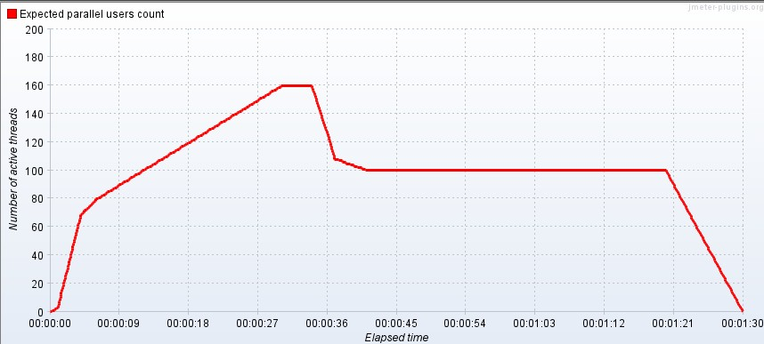
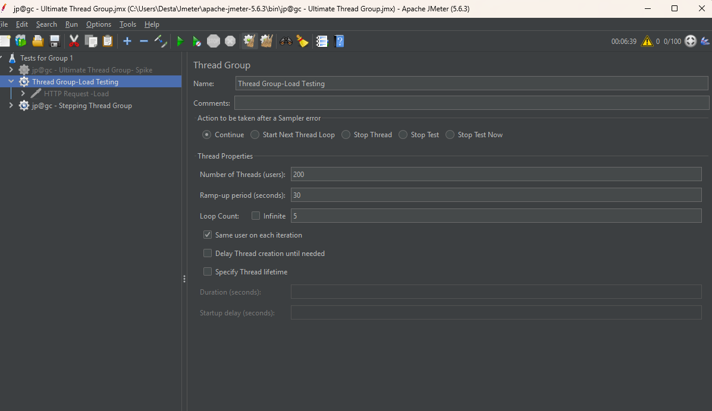
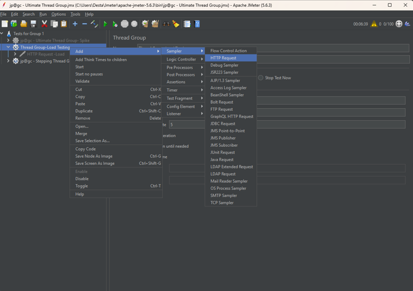
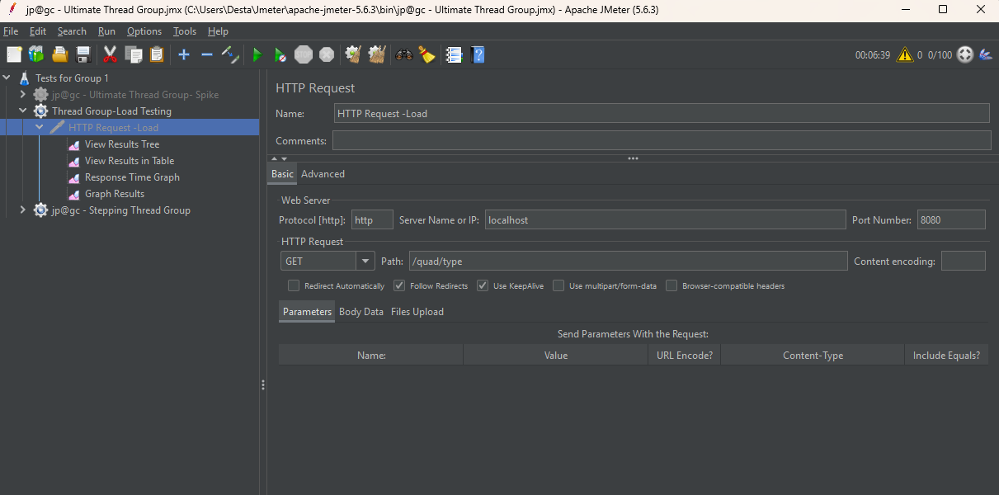
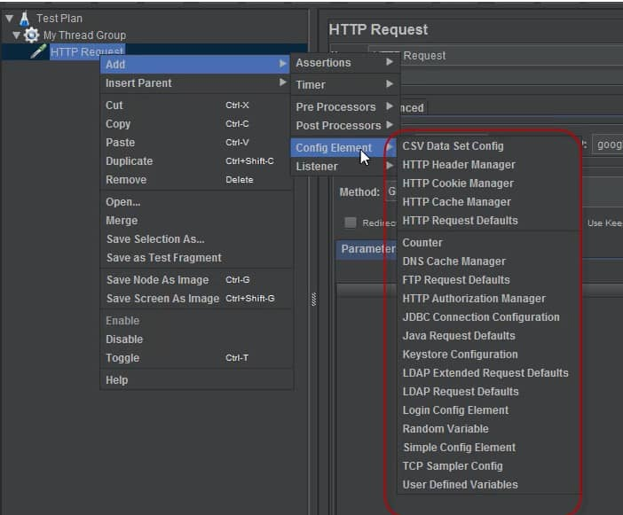
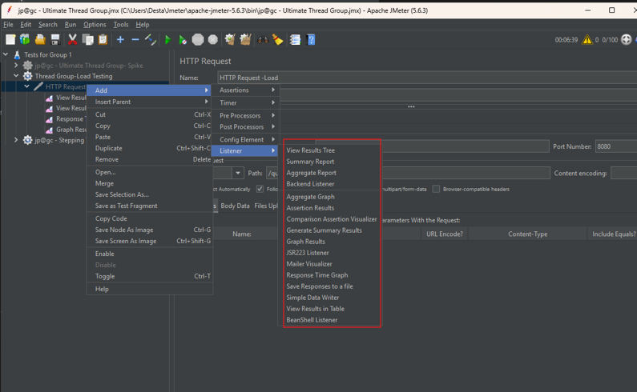
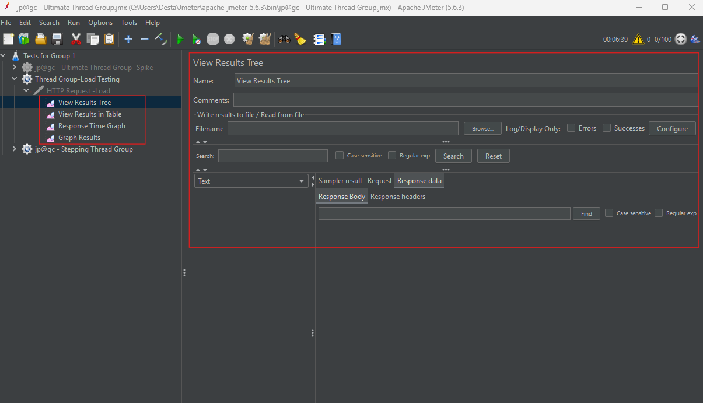

# Assignment 3
#Docker Desktop Assignment Substitute

https://github.com/user-attachments/assets/117e7b84-23a2-4a83-a987-7ab9f2507996

[Docker Desktop Assignment Substitute](./img/Docker_Desktop_Group_1_Assignment_Substitute.mp4)

# Performance Testing

## 1. Load Testing
Load testing is a way to check how well a system works when lots of people use it at the same time. It helps find problems, shows how much the system can handle, and makes sure everything runs smoothly during busy times.

https://github.com/user-attachments/assets/30bac481-9351-4e81-9c92-c7c3ecae47af

[Load Testing](./img/Group_1_Load_Testing.mp4)

## 2. Endurance (Soak) Testing
Endurance testing is when you run a system for a long time to see if it keeps working well. It helps catch problems that only show up after using it for hours or days, like slowing down or using too much memory.

## 3. Stress (Spike) Testing
Spike testing checks how a system handles sudden jumps in users, like during a flash sale or viral event. It helps find weak spots and makes sure the system can recover quickly after a big surge in traffic.

https://github.com/user-attachments/assets/be8383bb-236e-4ce7-a9e9-2bd6de2e7162

[Stress Testing ](./img/Group_1_Stress_Testing.mp4)

# Components of JMeter

## 1. Thread Groups

In JMeter, the most important thing to understand is the virtual user, which is called a thread. A Thread Group controls how many virtual users you want to test with, how fast they start, and how many times they repeat their actions. You can make different groups for different types of users, like shoppers or admins. Thread Groups also let you decide how long the test runs and what to do if something goes wrong. It's like setting up a test to see how a website or app handles a bunch of people using it at the same time.

## 2. HTTP Request Sampler

The JMeter HTTP Request is a sampler that sends different types of web requests (like GET or POST) to test how a server responds. You can configure it with details like the website address, request type, and data, and use tools like listeners to see the results and check if everything worked as expected.

## 3. Config Elements

Configuration Elements in JMeter let you set up reusable data or settings like variables, default values, or files to be used in samplers during testing. For example, CSV Data Set Config reads data from files, HTTP Request Defaults sets common request details, User Defined Variables lets you create custom variables, and HTTP Cookie Manager handles cookies across different requests.

## 4. Listeners

Listeners are tools that show and analyze test results in different formats, like tables, graphs, or logs, helping you understand how your application performs under load. Some common listeners include View Results Tree, Summary Report, Aggregate Report, and Graph Results, and they must be placed correctly in the test plan to collect data from the right parts of the test.

# Application Performance Index

Apdex (Application Performance Index) is a standardized way to measure user satisfaction with an application's response time, producing a score between 0 and 1 that reflects how well the app performs from the user's perspective. The score 0 represents no user satisfaction and 1 represents complete satisfaction.
This score is calculated using the number of satisfied, tolerating, and frustrated users. 
  -  **Satisfied**: Users who experience response times within the target threshold.
  -  **Tolerating**: Users who experience response times slightly above the target but still acceptable.
  -  **Frustrated**: Users who experience response times far beyond the acceptable range.

Apdex helps teams monitor and improve digital experiences, define service-level objectives (SLOs), and prioritize fixes, though it works best when combined with tools like Real User Monitoring (RUM) for a more complete view of customer experience.
