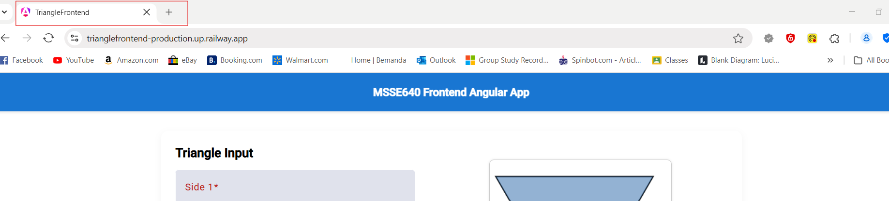
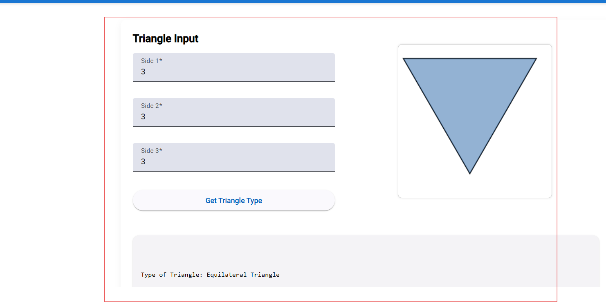
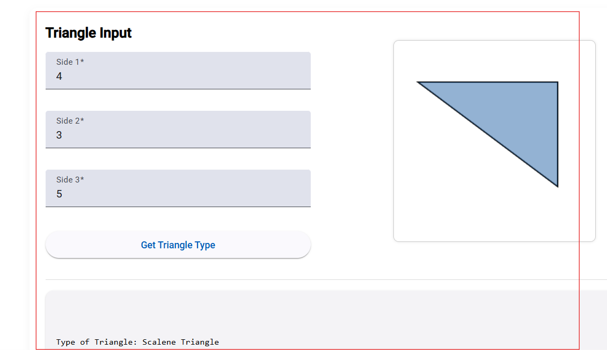
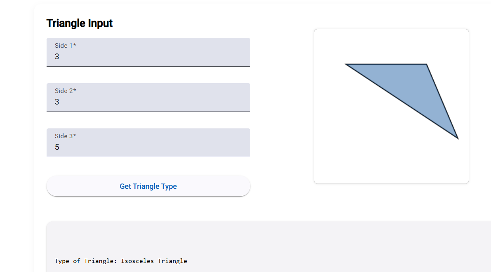
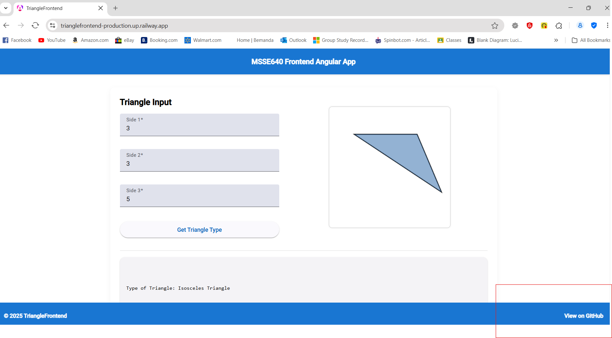
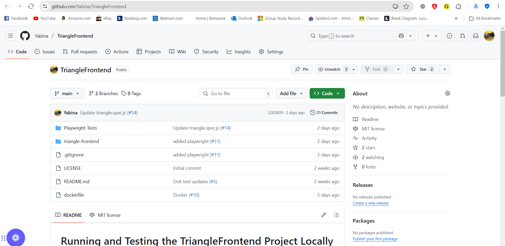
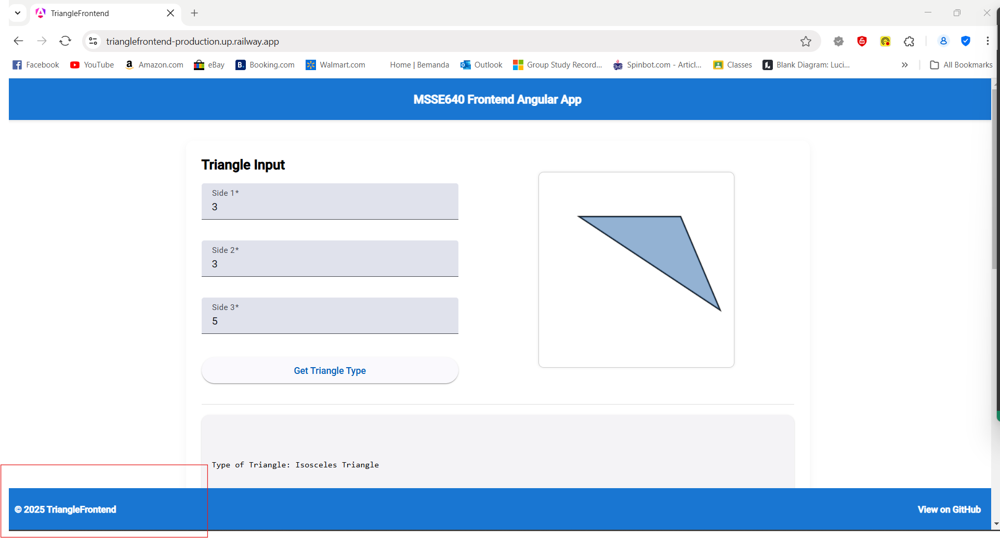

# Assignment 4

## Introduction

For this assignment, we have utilized **Playwright** for UI testing instead of Selenium to test our own application. We have developed a frontend for our application using **Angular**, leveraging modern web technologies to create a user-friendly interface. 


The frontend is hosted on **Railway App**, enabling public access for anyone to interact with our application. 

Explore our application [Here!](https://trianglefrontend-production.up.railway.app)


The primary goal of this assignment is to thoroughly test the UI of our application using Playwright, ensuring that the user experience is consistent and smooth across various scenarios. Playwright's powerful capabilities allow us to achieve effective testing with robust browser automation.

# Playwright Installment and Testing

Here is the Playwright site which contains good information and sample tests: 

https://playwright.dev/docs/writing-tests

## Getting Started

1. Navigate to the Playwright-Tests directory

2. Install node-modules

   ```
   npm install
   ```

3. Install playwright

   ```
   npx playwright install
   ```
## Running Tests

4. Run the tests

   ```
   npx playwright test triangle.spec.js
   ```

   or

   ```
   npm test
   ```


# Test Cases


## Test Case (TC001): Verify the Browser Title on the Homepage 


### Test Description:
Ensure that the homepage displays the correct browser title, "TriangleFrontend," when the application loads.

### Preconditions:
- The application is deployed and accessible.
- The user has a functional browser to access the application.

### Steps:
1. Open the browser and navigate to the application’s homepage: [https://trianglefrontend-production.up.railway.app](https://trianglefrontend-production.up.railway.app).
2. Wait for the homepage to load completely.
3. Check the browser tab title.

### Expected Result:
The browser tab title should display "TriangleFrontend."

### Test Script used (in TypeScript or JavaScript)

```markdown
import { test, expect } from "@playwright/test";

test("has title", async ({ page }) => {
  await page.goto("https://trianglefrontend-production.up.railway.app/");

  // Expect a title "to contain" a substring.
  await expect(page).toHaveTitle(/TriangleFrontend/);
  await expect(page.getByText("MSSE640 Frontend Angular App")).toBeVisible();
   //await page.pause();
});
```

##
## Test Case (TC002): Verify Triangle Identification as Equilateral

### Test Description:
Ensure that the application identifies a triangle as "Equilateral" when the user enters the same value for all three sides.

### Preconditions:
- The application is deployed and accessible.
- The user can access the triangle evaluation form.

### Steps:
1. Navigate to the application’s triangle evaluation page: [https://trianglefrontend-production.up.railway.app](https://trianglefrontend-production.up.railway.app).
2. Enter the value **3** in the input fields for all three sides.
3. Submit the form by clicking the "Evaluate" button.

### Expected Result:
The application should display the result: **"Type of Triangle: Equilateral"**.

### Test Script used (in TypeScript or JavaScript)

```markdown
test("get equilateral", async ({ page }) => {
  await page.goto("https://trianglefrontend-production.up.railway.app/");
  await page.getByRole("spinbutton", { name: "Side 1" }).fill("3");
  await page.getByRole("spinbutton", { name: "Side 2" }).fill("3");
  await page.getByRole("spinbutton", { name: "Side 3" }).fill("3");
  await page.getByRole("button", { name: "Get Triangle Type" }).click();
  await expect(page.getByText("Type of Triangle: Equilateral")).toBeVisible();
  //await page.pause();
});
```

##
## Test Case (TC003): Verify Triangle Identification as Scalene

### Test Description:
Ensure that the application identifies a triangle as "Scalene" when the user enters three different valid side lengths that satisfy the triangle inequality theorem.

### Preconditions:
- The application is deployed and accessible.
- The user can access the triangle evaluation form.

### Steps:
1. Navigate to the application’s triangle evaluation page: [https://trianglefrontend-production.up.railway.app](https://trianglefrontend-production.up.railway.app).
2. Enter the values **4**, **3**, and **5** in the respective input fields for the triangle sides.
3. Submit the form by clicking the "Evaluate" button.

### Expected Result:
The application should display the result: **"Type of Triangle: Scalene"**.

### Test Script used (in TypeScript or JavaScript)

```markdown
test("get scalene", async ({ page }) => {
  await page.goto("https://trianglefrontend-production.up.railway.app/");
  await page.getByRole("spinbutton", { name: "Side 1" }).fill("4");
  await page.getByRole("spinbutton", { name: "Side 2" }).fill("3");
  await page.getByRole("spinbutton", { name: "Side 3" }).fill("5");
  await page.getByRole("button", { name: "Get Triangle Type" }).click();
  await expect(page.getByText("Type of Triangle: Scalene")).toBeVisible();
  // await page.pause();
});
```

##
## Test Case (TC004): Verify Triangle Identification as Isosceles

### Test Description:
Ensure that the application identifies a triangle as "Isosceles" when the user enters two equal side lengths and one different side length that form a valid triangle.

### Preconditions:
- The application is deployed and accessible.
- The user can access the triangle evaluation form.

### Steps:
1. Navigate to the application’s triangle evaluation page: [https://trianglefrontend-production.up.railway.app](https://trianglefrontend-production.up.railway.app).
2. Enter the values **3**, **3**, and **5** in the respective input fields for the triangle sides.
3. Submit the form by clicking the "Evaluate" button.

### Expected Result:
The application should display the result: **"Type of Triangle: Isosceles"**.

### Test Script used (in TypeScript or JavaScript)

```markdown
test("get isosolies", async ({ page }) => {
  await page.goto("https://trianglefrontend-production.up.railway.app/");
  await page.getByRole('spinbutton', { name: 'Side 1' }).fill('3');
  await page.getByRole('spinbutton', { name: 'Side 2' }).fill('3');
  await page.getByRole('spinbutton', { name: 'Side 3' }).fill('5');
  await page.getByRole('button', { name: 'Get Triangle Type' }).click();
  await expect(page.getByText("Type of Triangle: Isosceles")).toBeVisible();
 // await page.pause();
});
```

##
## Test Case (TC005): Verify "View on GitHub" Link in the Footer

### Test Description:
Ensure that the "View on GitHub" link is visible, clickable, and navigates the user to the correct GitHub repository URL in a new tab or window.

### Preconditions:
- The application is deployed and accessible.
- The GitHub repository URL is correctly configured in the footer.

### Steps:
1. Open the application’s homepage: [https://trianglefrontend-production.up.railway.app](https://trianglefrontend-production.up.railway.app).
2. Scroll to the footer of the page.
3. Check if the "View on GitHub" link is visible.
4. Click the "View on GitHub" link.

### Expected Result:
- The "View on GitHub" link should be visible and clearly labeled in the footer.
- When clicked, the link should open the GitHub repository in a new tab or window.

### Test Script used (in TypeScript or JavaScript)

```markdown
test("has link", async ({ page }) => {
  await page.goto("https://trianglefrontend-production.up.railway.app/");
  await page.getByRole('link', { name: 'View on GitHub' }).click();
  await expect(page).toHaveURL(new RegExp("https://trianglefrontend-production.up.railway.app/"));
  await expect(page.getByText('TriangleFrontend')).toBeVisible();
 
 await page.pause();
});
```


##
## Test Case (TC006): Verify Footer Displays Copyright Text

### Test Description:
Ensure that the footer displays the text "© 2025 TriangleFrontend" to indicate ownership rights to the application.

### Preconditions:
- The application is deployed and accessible.
- The footer section is properly implemented in the application.

### Steps:
1. Open the application’s homepage: [https://trianglefrontend-production.up.railway.app](https://trianglefrontend-production.up.railway.app).
2. Scroll to the bottom of the page to view the footer.
3. Verify the presence of the text "© 2025 TriangleFrontend" in the footer.

### Expected Result:
The text "© 2025 TriangleFrontend" should be clearly displayed at the bottom of the page.

### Test Script used (in TypeScript or JavaScript)

```markdown
test("has footer", async ({ page }) => {
  await page.goto("https://trianglefrontend-production.up.railway.app/");
  await page.getByText('© 2025 TriangleFrontend').click();
  await expect(page.getByText('© 2025 TriangleFrontend')).toBeVisible();
 //await page.pause();
});
```

##